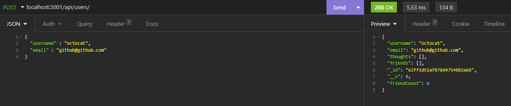
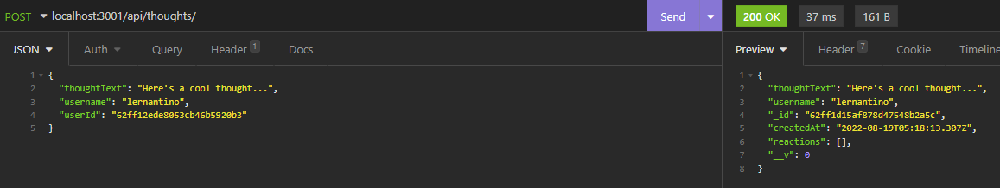

# Social Media Api (MongoDB + Mongoose)

## Description

This repository contains a back end framework for a simple social media app. The back end uses a NoSQL database which is created using MongoDB and Mongoose. It also uses Express and node.js to create a RESTful api. This database works by having 'User' and 'Thought' mongoose models to represent users and user posts. Using the RESTful api, you can create, update, and delete users, thoughts, and reactions to thoughts.

## Working API

### Create a new user

### Create a new thought

## Installation

1) Clone down the repository
2) Git Bash/ Terminal to where the directory is stored on your local machine
3) Run 'npm install' to download the required node packages
4) Run 'npm seed' to prepopulate user model with user information
5) Run 'npm start' to start the server

## Tutorial

[Tutorial Link](https://youtu.be/PItJlGoTRtc)

## License
 

Licensed under the [MIT](https://opensource.org/licenses/MIT) license

## Questions
Contact me via email at hmanjuna@ucsc.edu
View my other projects on [github](github.com/hmanjun) 